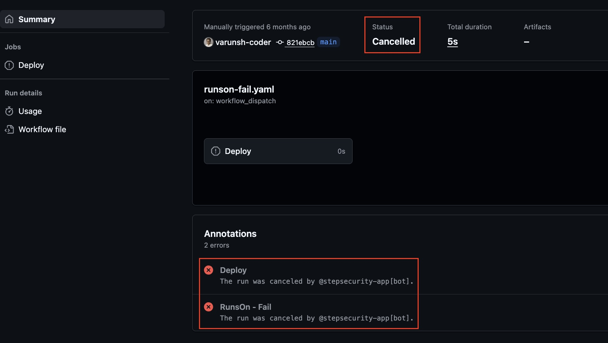
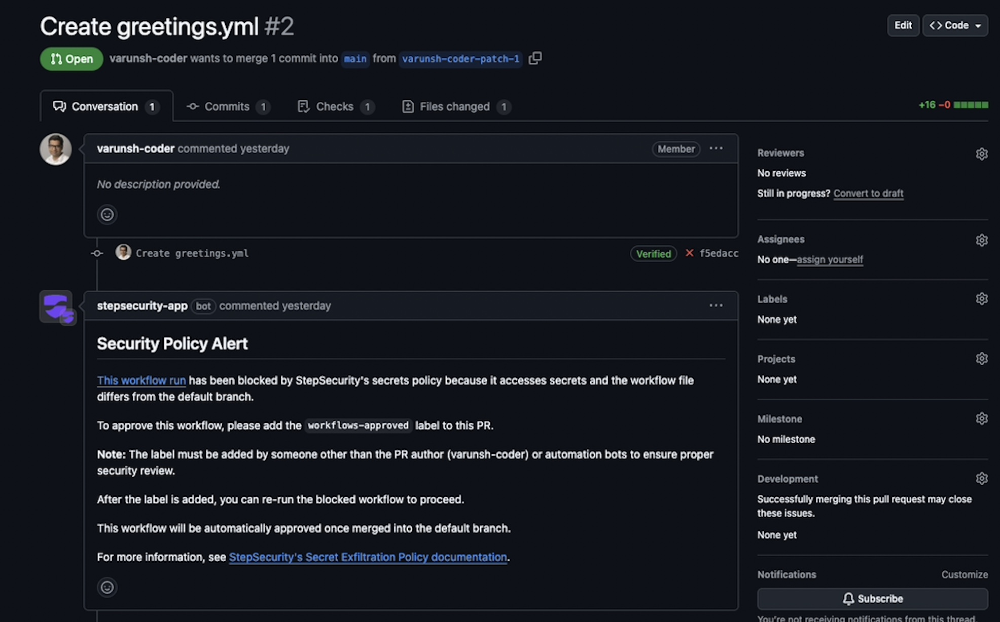
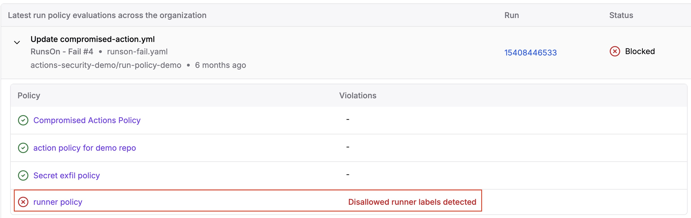
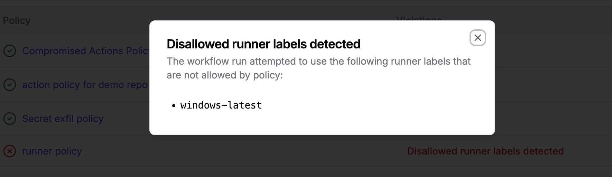

# Workflow Run Policies – Testing Detections
 
Workflow Run Policies allow you to enforce security controls by blocking GitHub Actions workflow runs that violate organization-defined policies. For more information, see [here](https://docs.stepsecurity.io/workflow-run-policies). 

This repository is designed to help you quickly test and validate StepSecurity Workflow Run Policies. Each workflow in this repo intentionally violates a specific policy so you can confirm the detection and workflow cancellation behavior. The four policy types include:

* **Compromised Actions** - Blocks workflow runs containing a **known compromised action**
* **Allowed Actions** - Blocks workflow runs that **do not explicitly allow actions** (*by specific version, or all versions*)
* **Runner Label Disallow** - Blocks workflow runs that attempt to run on specified runner labels
* **Secret Exfiltration Policy** - Blocks workflows where a non-default branch's workflow has been modified to access repository secrets 

## Setting up and Testing Policies
The general flow to trigger these detections is as follows:

1. Set up a policy from the Workflow Run Policies tab on the StepSecurity dashboard for each policy type
2. Trigger a workflow that fails for each respective policy type and observe the cancellation on the non-compliant workflow
3. (Optional) Trigger any one of the workflows via a PR - StepSecurity will comment on the PR with the failure information for developer context 

Below are details on how to set up a rule for each policy type and trigger a detection

### 1. Compromised Actions Policy 

The Compromised Actions Policy blocks workflows that attempt to use a known compromised action. This workflow contains a dummy compromised action (`step-security/dummy-compromised-action`), that is flagged as compromised by StepSecurity for testing purposes. 

* Create a Workflow Run Policy on app.stepsecurity.io under **Workflow Run Policies → Policies → Create Policy** 
* Ensure the policy type is set as a **Compromised Actions Policy** and apply to your repository
* Run the workflow [compromised-action.yml](https://github.com/stepsecurity-poc/stepsecurity-poc-workflow-run-policies/blob/main/.github/workflows/compromised-action-block.yml) and observe the job cancellation
* This workflow also triggers on pull_request - take a look at the PR details for failure context 

### 2. Allowed Actions Policy

The Allowed Actions Policy blocks workflows that attempt to use any actions that are not explicitly allowed. StepSecurity's allow-list allows you to define granular *repo-scoped* policies, and does not implicitly trust forked third-party actions as is the case with GitHub allow-lists. This workflow contains an action (`docker/setup-buildx-action`) that will be blocked, then allowed per a defined policy. 

* Create a Workflow Run Policy on app.stepsecurity.io under **Workflow Run Policies → Policies → Create Policy** 
* Ensure the policy type is set as an **Allowed Actions Policy** and apply to your repository
* Run the workflow [allowed-action-policy.yml](https://github.com/stepsecurity-poc/stepsecurity-poc-workflow-run-policies/blob/main/.github/workflows/allowed-actions-policy.yml) and observe the job cancellation as the action is not explicitly allowed
* Navigate to the policy on the **Workflow Run Policies → Policies → Edit Policy** and allowing the `docker/setup-buildx-action` through the Allowed Actions menu.
* Re-run the workflow and observe it is allowed to run

### 3. Runner Label Policy 

The Runner Label Policy blocks workflows from running that attempt to run on a runner that has been explicitly disallowed in the policy. This can be used for disallowing usage of GitHub-hosted runners. This workflow runs on `windows-latest`; a policy will be created to block any usage of `windows-latest`, resulting in cancellation of the run. 

* Create a Workflow Run Policy on app.stepsecurity.io under **Workflow Run Policies → Policies → Create Policy** 
* Ensure the policy type is set as a **Runner Label Policy** and apply to your repository. Set the disallowed runner label as `windows-latest` 
* Run the workflow [runner-label-block.yml](https://github.com/stepsecurity-poc/stepsecurity-poc-workflow-run-policies/blob/main/.github/workflows/runner-label-block.yml) and observe the job cancellation

### 4. Secret Exfiltration Policy

The secret exfiltration policy blocks secret access on **non-default branches** unless the workflow **matches the default branch** or has **explicit approval**. This test workflow dumps all secrets using `toJSON(secrets)` and uploads them as an artifact to simulate a secret-exfiltration attack. **This workflow must run on non-default branch**. 

* Create a Workflow Run Policy on app.stepsecurity.io under **Workflow Run Policies → Policies → Create Policy** 
* Ensure the policy is set as a **Secret Exfiltration Policy** and apply to your repository
* **Create a new branch** OR if you have forked the repository to test, the secret-exfiltration-branch contains the [secret-exfiltration-workflow.yml](https://github.com/stepsecurity-poc/stepsecurity-poc-workflow-run-policies/blob/main/.github/workflows/secret-exfiltration.yml).
* **From the new branch**, make a dummy commit (add a space to any file and commit) to trigger the workflow. You can also open a PR to see the PR comment context. This simulates a workflow in a non-default branch that attempts to access repository secrets

 ## Observing Results 

 There are 3 primary ways to see information about cancelled workflow runs:

 1. On the GitHub Actions run page, it will show the status as cancelled and seen in the Annotations section

 2. If the workflow was triggered by a PR, the PR will be commented with context on the cancellation and makes suggestions on next steps.

 3. On the StepSecurity dashboard, you can centrally manage all workflow runs in the **Workflow Run Policies → Policy Evaluations** section. Filter here by `Status: Blocked` to see blocked runs, and expand to see context on the block. 

 
